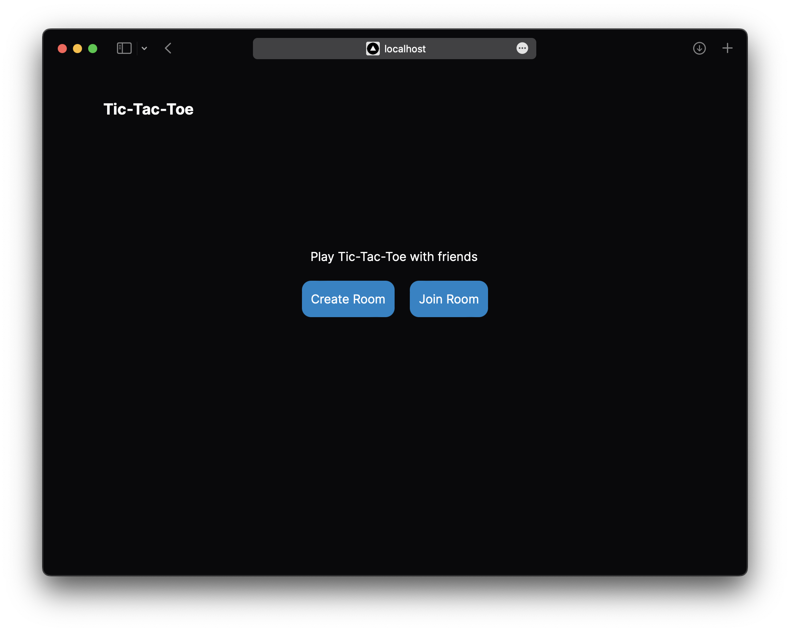
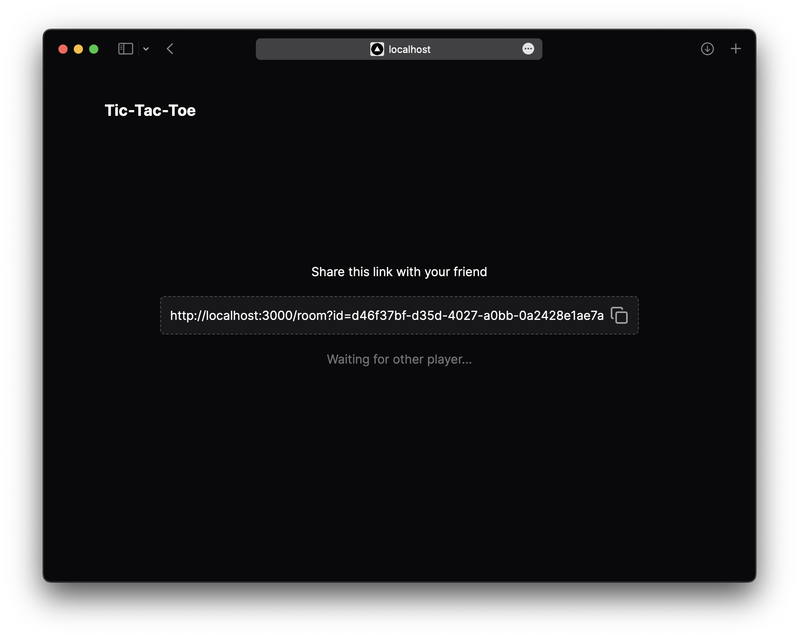
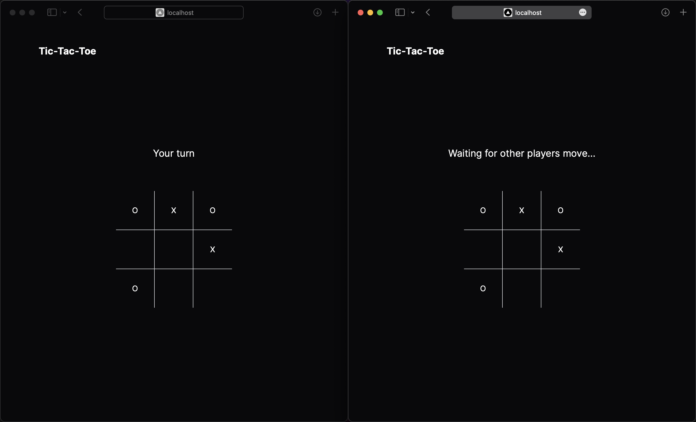

# Tic-tac-toe

Play Tic-tac-toe with your friends. Create Rooms, join rooms and play together.
built using [websockets](https://developer.mozilla.org/en-US/docs/Web/API/WebSockets_API)

  
   

- **Frontend**: [Next.js](https://nextjs.org/)
- **Backend**: Vanilla Typescript
- **Library**: [ws](https://www.npmjs.com/package/ws)

# TODO
- [ ] Add "Play Again" button
- [ ] Allow continuing game if page refreshes
- [ ] Fix issues when game runs on local network
- [ ] Abstract `server/src/room.ts` into a `EventEmitter` class
- [ ] Improves types
- [ ] Join Room by entering code
- [ ] add `noUncheckedIndexedAccess` to `server/tsconfig.json`
